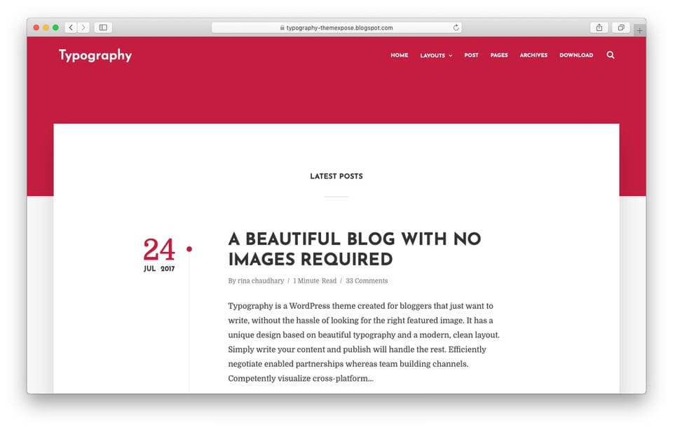

# <a href="https://typography-themexpose.blogspot.com/">Typography</a>

  

Reference: <a href="https://www.niagahoster.co.id/blog/template-blogger-responsive/">Niagahoster: 30+ Template Blogger Responsive dan Gratis!</a>

Bagi Anda yang membangun blog berbasis Blogger dengan mengedepankan tulisan, inilah template untuk Anda. Typography cocok untuk blog pribadi maupun blog bagi penulis untuk menunjukkan hasil karyanya.

Template blogger ini sangat minimalis sehingga memudahkan Anda menuliskan ide tanpa bingung memilih gambar yang tepat.

Sesuai dengan namanya, Typography menggunakan jenis font yang enak dibaca. Tujuannya, membuat pengunjung Anda ingin berlama-lama membaca posting Anda yang menarik. 

Jangan khawatir dengan performa template ini. Typography ramah SEO dan memiliki waktu loading yang cepat. Tidak hanya itu, template blogger ini sudah fully-responsive dan memiliki banyak fitur, seperti auto-resize thumbnail dan lainnya.
